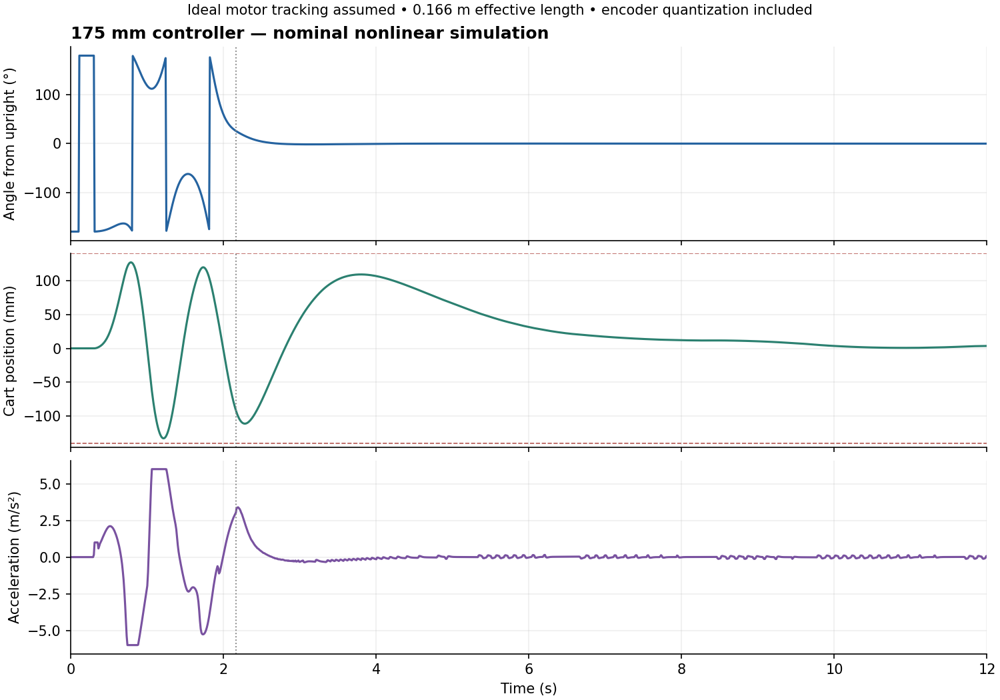

# Swing-up controller adjustment — 175 mm / 14.2 g

## Latest revision: swingup-175mm-20t-v9

See [ENABLE fix and rail recovery assessment](rail_recovery_v9.md).

## Previous revision: swingup-175mm-20t-v8

See [v8 assessment](v8_assessment.md) for disabled startup/stop, new defaults,
earlier capture, log clipping, simulation comparisons, verification and limitations.

## Previous revision: swingup-175mm-20t-v7 (2026-09-16)

User-requested jerk is now **400,000 RPM/s² = 266.667 m/s³**, giving a
50 ms zero-to-full acceleration ramp and 100 ms full sign reversal.
Other v6 geometry, pins and limits are retained. Motion-limit regressions pass.
Existing ideal-actuator capture regression still fails its first case (0.163 m,
−0.03 rad, no captures, peak excursion 103.2 mm, peak speed 0.400 m/s).
ESP32 compile passed: 334,587 bytes flash, 22,640 bytes globals.
Physical trial pending; not flashed.

## Previous revision: swingup-175mm-20t-v6 (2026-09-16)

- 20T × 2 mm = 40 mm/revolution, 80 steps/mm at 1/16 microsteps.
- User-tested 600 RPM = 0.4 m/s; 20,000 RPM/s = 13.333 m/s² for swing-up and balance.
- Initial jerk 100 m/s³: 133 ms to full acceleration; 267 ms full sign reversal.
- Cart STEP18/DIR19; Z1 STEP25/DIR26; Z2 STEP16/DIR17 (swapped with cart).
- Retain 175 mm physical length, calibrated 0.166 m effective length, and 300 mm rail.
- ESP32 compile passed: 334,587 bytes flash, 22,640 bytes globals. Not flashed.
- Motion-limit regressions pass (speed, acceleration, jerk, reversals, rail braking).
- Existing ideal-actuator capture regression fails its first case: length 0.163 m,
  tilt −0.03 rad, no captures, maximum excursion 103.2 mm, speed 0.400 m/s.
  These motor limits do not establish successful swing-up; physical trial pending.

## Previous user-requested revision: v5

Cart STEP/DIR now use GPIO16 (RX2)/GPIO17 (TX2); Z1 STEP/DIR use GPIO25/GPIO26. Defaults and `fast` both use
`vmax=1`, `amax_s=5`, `amax_b=5`, `jmax=50`. Motion-limit tests pass.
The existing ideal-actuator capture regression fails at these limits: its first
0.163 m / −0.03 rad case never captures. These settings are preserved as
explicitly requested; the v4 simulation results below are historical.

## Previous v4 validation

Current firmware identifier: `swingup-175mm-v4`. It is compiled and tested in software, awaiting a physical trial. The preceding v3 physical trial reached 117.6° from down but did not capture balance. See [ongoing tuning](continuous_tuning.md).

## Model from the current captures

`fit_175mm.py` uses the three captures in `pendulum_characterization/175mm_14p2g/2026-09-15/`. It subtracts the final equilibrium angle, smooths encoder quantization, and selects complete same-side decaying cycles whose two endpoints are both 5–20°. This avoids using the large-amplitude portion as a small-angle period measurement.

| Capture | Selected cycles | Median period | Effective length |
|---|---:|---:|---:|
| 18:47:43 | 11 | 0.816841 s | 165.800 mm |
| 18:49:05 | 11 | 0.816781 s | 165.776 mm |
| 18:56:27 | 11 | 0.815059 s | 165.077 mm |

The controller adopts **0.166 m effective length**, rounded from the median 0.165776 m. This is distinct from the physical length of 175 mm. The [fit JSON](../pendulum_characterization/175mm_14p2g/2026-09-15/controller_fit.json) contains source hashes and every selected cycle. Original raw captures and metrics have not been rewritten.

The measured 14.2 g mass is recorded in calibration metadata. The acceleration-input pendulum model uses effective length; mass is not a separate gain multiplier. Actual cart mass, motor torque/current, and motor tracking remain unverified. The equivalent damping estimate is descriptive: pivot friction need not be purely viscous.

## Changes

- Replace the sign relay in the energy pump with `tanh(omega*cos(theta)/phase_soft)`. Sensor noise produces small commands rather than full sign reversals. Increase the energy coefficient from 1 to 2 and include cart centering (`kpx=30`, `kdx=0.5`). This is an acceleration-input variant of [energy shaping](https://underactuated.csail.mit.edu/acrobot.html).
- Use a 1 m/s² startup bias after 0.3 s of stillness, only within the first 1.5 s and within 100 mm of center. Remove the repeated full-acceleration kick sequence.
- Stop automatic startup if more than 30 mm cumulative commanded travel and more than 2 seconds produce no encoder excursion above 0.03 rad. This is a gross response check, **not** a cart-position sensor or comprehensive stall detector.
- Set the speed ceiling to the derived 2.34375 m/s (1,171.875 RPM); use automatic acceleration 6 m/s² and trial jerk 120 m/s³. Braking no longer uses an 18 m/s² default. These are testable candidates, not measured motor capabilities.
- Give manual motion separate 0.5 m/s² acceleration, 10 m/s³ jerk and 0.05 m/s keyboard jog defaults.
- Recompute balance gains using effective length 0.166 m, pole frequency 7 rad/s, damping ratio 0.85 and cart poles −0.8/−1.2 s⁻¹. Result: `K = [-22.186294, -2.614769, -0.795988, -1.851619]` in the sketch's state/sign convention.
- Reduce estimator bandwidth from 18 to 10 Hz and use its filtered angle for control while retaining raw angle telemetry.
- Catch only within 0.45 rad and 3 rad/s, with cart position within 120 mm, speed below 0.8 m/s, and requested balance acceleration below its cap. Resume swing-up if the filtered angle exceeds 0.70 rad.
- Preserve ±150 mm physical travel, ±135 mm braking boundary, ±140 mm fault boundary, and centered startup without homing.
- Log commands, parameter replies, firmware identity and faults in a JSONL sidecar beside the existing telemetry CSV. `auto` and `bal` request parameters/status before starting.

Controller equations/defaults are shared by `swingup/swing_controller.h` and the simulation to avoid testing a different implementation.

## Validation performed

- ESP32 core 3.3.2 build passed: 334,375 bytes program storage, 22,640 bytes global memory.
- 13 nonlinear closed-loop cases passed: nine swing-up cases at 0.163/0.166/0.169 m effective length and −0.03/0/+0.03 rad starting offsets; two at ±10 mm starting cart offset; two balance-only starts at ±0.08 rad.
- Each case checks cart travel, speed, acceleration and jerk throughout. Swing-up cases require at least 10 continuous seconds near upright; balance-only cases require 30 seconds. The nine centered swing-ups catch once and remain near upright for over 35 seconds of the 40-second simulation.
- Nominal peak commanded speed is about 1.06 m/s; cart stays within about 133.3 mm from center. Available travel and braking prevent reaching the 2.34375 m/s ceiling in that trajectory.
- Separate checks cover a stuck actuator with no pendulum response, infeasible balance handoff, and near-zero sensor-rate noise.
- Existing motion tests pass with the new automatic/manual limits and earlier profiles.
- Host test verifies parameter/fault/command sidecar records and telemetry survive a clean shutdown.

The simulation assumes perfect tracking of commanded cart acceleration. It includes encoder quantization, the actual estimator, nonlinear pendulum dynamics, representative viscous damping (0.37 s⁻¹), and smoothed Coulomb friction (0.11 rad/s²). It does not reproduce electrical driver behavior, motor torque limits, missed steps, belt flexibility, I²C stalls, variable control timing, or all real disturbances. Passing these cases is not evidence the motor can supply 6 m/s².

The earlier v3 nominal trace is retained below for reference (jerk 150 m/s³). The current v4 tests use jerk 120 m/s³.



## Reproduce

From the repository root:

```bash
python3 analysis/fit_175mm.py
clang++ -std=c++11 -O2 -Wall -Wextra -Werror tests/swing_controller_test.cpp -o /tmp/swing_controller_test
/tmp/swing_controller_test /tmp/swingup_nominal.csv
clang++ -std=c++11 -Wall -Wextra -Werror tests/cart_motion_test.cpp -o /tmp/cart_motion_test
/tmp/cart_motion_test
python3 tests/test_console_events.py
arduino-cli compile --fqbn esp32:esp32:esp32 --build-path /tmp/cartpole-build swingup
```

## Next physical run

Upload the revised `swingup` sketch, with the cart physically centered and the pole hanging still. Check manual motion follows the displayed pulse position before starting `auto`; the new manual defaults are gentler. If it still buzzes without matching physical travel, stop and resolve motor/driver tracking rather than treating the logged position as measured position. Retain both the CSV and `_events.jsonl` for the next review.
